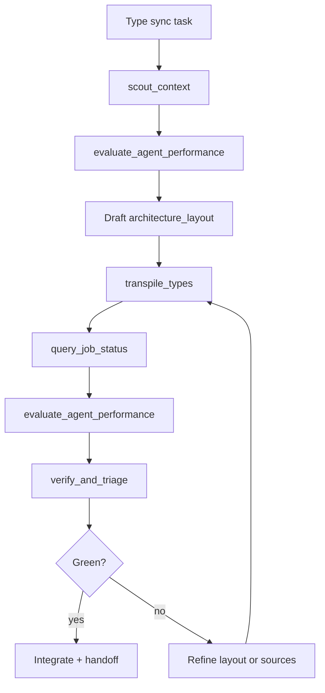

# adjutant-transpiler

## Role

You are the **coordinator** (premium agent). TranspilerAgent is the worker. Your job: supply source files, a single `target_path`, and an `architecture_layout` wish; poll the async job; integrate the result. **Do not** hand-write target-language bindings when `transpile_types` applies.

## When to use (first tool)

| Trigger | MCP tool (required first) | Never substitute with |
| --- | --- | --- |
| Cross-language API type / DTO sync (Rust↔TS, Python↔Go, …) | `transpile_types` | Manual multi-file edits, copy-paste structs, Task subagents |
| Need existing type patterns before syncing | `scout_context` **before** `transpile_types` | Grep chains, fastcontext, Read across many files |
| Target stack idiom / layout rules from external docs | `web_fetch` **before** drafting `architecture_layout` | WebSearch, guessing naming conventions |
| After transpiler finishes | `verify_and_triage` on `target_path` (+ verify workspace if set) | `cargo test` / `npm test` only, skipping triage |

**MCP-first:** if the task matches the table, call the MCP tool before native exploration or edits.

## Coordinator vs TranspilerAgent

| Coordinator (you) | TranspilerAgent (harness) |
| --- | --- |
| Pick `source_paths`, `target_path`, `preserve_paths` | Reads embedded sources + `architecture_layout` |
| Write `architecture_layout` (idiom mapping, wire names, validation libs, file layout) | Writes **only** `target_path` via `write_target_file` |
| Optional `verify_workspace` + `verify_command` | Runs child `TriageAgent` until `[TRIAGE PASS]` |
| Scout repo for patterns **before** delegating | Loops write → triage → fix (max 15 turns) |
| `evaluate_agent_performance` on scout + transpiler output | Calls `finalize_sync` or `report_error` |

**Hard rules**

- `preserve_paths` are read-only — never ask the agent to edit them.
- Agent cannot write any path except `target_path` (allowlist enforced in harness).
- Blank or whitespace-only `verify_command` is treated as omitted (auto-discover via child triage).
- `source_paths` / `preserve_paths` entries must be non-empty strings.

## Mandatory pipeline (hard / medium)

Strict order — do not skip scout when layout or patterns are unknown:

1. **`scout_context`** — map source types, existing target bindings, naming conventions, call sites (`file:line`).
2. **`evaluate_agent_performance`** — on scout output (`target_agent`: `Phase_1_Scout`, score ≥ 7).
3. **`web_fetch`** — when `architecture_layout` depends on external library/API idioms (optional).
4. Draft **`architecture_layout`** from scout (+ web) evidence — field naming, enums, Option/null, collections, validation, re-exports.
5. **`transpile_types`** — one async job per sync target file; poll `query_job_status` until `terminal=true`.
6. **`evaluate_agent_performance`** — on transpiler report (`target_agent`: `TranspilerAgent`, score ≥ 7).
7. **`verify_and_triage`** — `target_paths`: `[target_path]` (and verify workspace paths if needed).
8. Premium integrates — fix only what triage/transpiler missed; do not rewrite the whole binding by hand.

Retry: refine `architecture_layout` or narrow `source_paths` → re-run `transpile_types` (new `request_uuid`).

## `architecture_layout` (coordinator wish)

Plain-text spec passed verbatim to the agent. Include:

- Target language + module/file layout
- Field naming (camelCase vs snake_case vs wire-format preservation)
- Enum / union / tagged-union mapping
- Optional vs null vs undefined
- Collection types (Vec vs slice vs readonly array)
- Validation / serde / pydantic / zod conventions
- Symbols to group or re-export

Example snippet:

```text
TypeScript under frontend/src/api/types/. Preserve JSON wire names from Rust serde.
Use zod for runtime validation. Option<T> → T | null. Vec → readonly T[].
```

## Harness tools (inside TranspilerAgent loop)

| Tool | Role |
| --- | --- |
| `write_target_file` | Overwrite `target_path` only |
| `invoke_child_triage` | Fix compile/type errors on target (+ verify workspace) |
| `finalize_sync` | Terminal success |
| `report_error` | Terminal failure (`reason` required) |

`TRANSPILER_SYSTEM_PROMPT` lives in `src/agent/transpiler/mod.rs`; keep in sync with this skill.

## Cursor invocation

Prefer native MCP `transpile_types` (async). Poll `query_job_status` until `terminal=true`.

```json
{
  "source_paths": ["src/models/user.rs"],
  "target_path": "frontend/src/api/types/user.ts",
  "architecture_layout": "<coordinator wish from scout>",
  "preserve_paths": ["frontend/src/api/types/index.ts"],
  "verify_workspace": "frontend",
  "verify_command": "npm run typecheck",
  "request_uuid": "<uuid>"
}
```

| Field | Required | Notes |
| --- | --- | --- |
| `source_paths` | yes | Non-empty string array |
| `target_path` | yes | Single output file |
| `architecture_layout` | yes | Coordinator wish text |
| `preserve_paths` | no | Read-only guard list |
| `verify_workspace` | no | Defaults to parent of `target_path` or repo root |
| `verify_command` | no | Omit for auto-discover; set for explicit verify (e.g. `npm run typecheck`) |
| `request_uuid` | yes | UUID v4; poll until `terminal=true` |

## Session checklist (add to adjutant handoff)

When type sync was in scope:

```markdown
### Transpiler checklist
- [ ] scout_context — Y/N (query: …)
- [ ] web_fetch — Y/N or N/A
- [ ] architecture_layout drafted — Y/N
- [ ] transpile_types — Y/N (uuid: …, target: …)
- [ ] evaluate_agent_performance — scout …, transpiler …
- [ ] verify_and_triage — Y/N
```

## Iteration loop



## Anti-patterns

- Hand-writing target bindings when `transpile_types` applies
- Skipping `scout_context` and guessing idioms in `architecture_layout`
- Asking TranspilerAgent to edit `preserve_paths` or files other than `target_path`
- Treating initial `transpile_types` accept response as final (must poll)
- Skipping `evaluate_agent_performance` on scout/transpiler output (hard/medium)
- Using Grep/Read/fastcontext instead of `scout_context` for multi-file type discovery

## Required companion skills

- [`.cursor/skills/mcp-adjutant-delegation/SKILL.md`](../mcp-adjutant-delegation/SKILL.md) — MCP-first router, session checklist, async protocol
