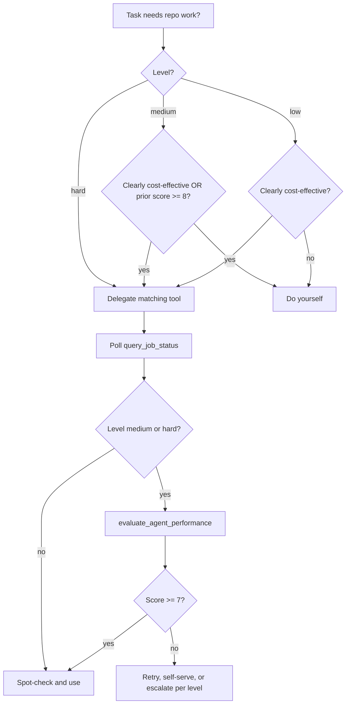

# mcp-adjutant delegation

Offload expensive, repetitive work to **mcp-adjutant** sub-agents (Scout, Triage, Builder, Evaluator). They run on cost-effective models configured in the mcp-adjutant config UI. You stay on the premium model for judgment, integration, and user-facing decisions.

**Prerequisite:** `mcp-adjutant` MCP must be connected with these tools available:

| Tool | Sub-agent | Delegate when |
| --- | --- | --- |
| `scout_context` | Scout | Need repo context without loading files into your window |
| `verify_and_triage` | Triage | After code changes — compile, type-check, trivial fixes |
| `generate_tests_and_scaffolding` | Builder | Unit/integration/factory tests for a specific file |
| `evaluate_agent_performance` | Evaluator | QA a sub-agent result before trusting or re-delegating |
| `query_job_status` | — | Poll every async job until `terminal=true` |

## Set delegation level

Resolve level in this order (first match wins):

1. **User instruction** — e.g. "delegation: hard" or "use adjutant sparingly"
2. **`MCP_ADJUTANT_DELEGATION_LEVEL`** env var — `low`, `medium`, or `hard`
3. **Default:** `medium`

Announce the active level once per session when you first delegate.

---

## LOW — delegate only when clearly cost-effective

Delegate **only** when you are confident the sub-agent can complete the task without premium-model judgment.

### Delegate (low)

| Situation | Tool |
| --- | --- |
| Broad repo search across many files | `scout_context` |
| Mechanical compile/type errors (imports, typos, missing semicolons) | `verify_and_triage` |
| Boilerplate test files for an existing function/module | `generate_tests_and_scaffolding` |

### Do NOT delegate (low)

- Architecture or API design decisions
- Security-sensitive changes (auth, crypto, injection)
- Multi-file refactors requiring trade-off judgment
- Tasks where you need fewer than ~3 files of context
- When mcp-adjutant is not connected or API keys are unset

### Low workflow

1. Ask: "Would a cheaper model succeed here with no ambiguity?" If no → do it yourself.
2. Call the tool with a precise `request_uuid` (UUID v4).
3. Poll `query_job_status` until `terminal=true`.
4. Skim the result; spot-check critical claims before acting on them.

---

## MEDIUM — balanced (default)

Start selective like **low**, then **adapt** based on evaluator scores from past delegations in this session.

### Initial gate (same as low)

Before first delegation on a task type, apply the low-mode "clearly cost-effective" test.

### After each delegation

Call `evaluate_agent_performance` when the result will influence your next steps:

```json
{
  "target_agent": "Phase_1_Scout",
  "original_task": "<what you asked for>",
  "received_output": "<sub-agent result>",
  "request_uuid": "<new-uuid>"
}
```

Poll until `terminal=true`. Parse the JSON score and critique.

### Adapt using evaluator score

| Score | Next action |
| --- | --- |
| **8–10** | Keep delegating similar tasks to mcp-adjutant |
| **5–7** | Delegate again only with a tighter, more specific prompt; verify key facts yourself |
| **1–4** | Stop delegating this task category; do remaining work yourself |

Track mentally per category: **scout**, **triage**, **builder**.

### Medium-specific rules

- **Scout** → delegate when exploration spans 5+ files or unknown layout; otherwise use local search/read.
- **Triage** → delegate after every substantive edit batch; skip for comment-only or doc-only changes.
- **Builder** → delegate one file at a time; review generated tests before committing.
- Re-evaluate after **two consecutive scores below 6** for the same category → switch that category to self-serve until the user asks otherwise.

---

## HARD — always delegate when tools apply

Prefer mcp-adjutant over doing the work yourself whenever a matching tool exists.

### Hard rules

| Trigger | Required action |
| --- | --- |
| Any non-trivial task needing repo context | `scout_context` first |
| Any code change (including small edits) | `verify_and_triage` before commit or handoff |
| New or modified source file without tests | `generate_tests_and_scaffolding` |
| Every sub-agent result before use | `evaluate_agent_performance` |

### Hard workflow

1. Generate a fresh `request_uuid` per tool call.
2. Fire the tool; immediately poll `query_job_status` (do not guess timeouts).
3. On `terminal=true` with `status=completed`, run `evaluate_agent_performance`.
4. If evaluator score **< 7**, retry once with a refined prompt or escalate to the user — do not silently accept weak output.
5. Integrate verified results into your response; cite what the sub-agent found/changed.

### Hard exceptions (still do yourself)

- Direct user chat, clarifying questions, and final summaries
- Choosing between architectural alternatives (sub-agents inform, you decide)
- When mcp-adjutant tools are unavailable — fall back gracefully and tell the user

---

## Async job protocol (all levels)

Every heavy tool requires `request_uuid`. **Never** treat the initial response as the final result.

```
1. uuid = new UUID v4
2. call tool(..., request_uuid=uuid)
3. loop: query_job_status(request_uuid=uuid) until terminal=true
4. if status=completed → use result
   if status=failed    → read error; decide retry/self-serve per level
   if possibly_stalled → keep polling (advisory only)
```

Run polls in the same turn when possible. Do not ask the user to wait without polling.

---

## Tool argument quick reference

**scout_context**

```json
{ "query": "Where is X implemented and how does Y interact?", "request_uuid": "<uuid>" }
```

**verify_and_triage**

```json
{ "target_paths": ["src/foo.rs"], "request_uuid": "<uuid>" }
```

Omit `target_paths` or pass `[]` to use git dirty files.

**generate_tests_and_scaffolding**

```json
{
  "source_file_path": "src/agent/scout.rs",
  "test_type": "unit",
  "request_uuid": "<uuid>"
}
```

`test_type`: `unit` | `integration` | `factory`

**evaluate_agent_performance**

```json
{
  "target_agent": "Phase_1_Scout",
  "original_task": "Find JWT middleware entry points",
  "received_output": "<paste sub-agent output>",
  "request_uuid": "<uuid>"
}
```

---

## Decision flowchart



---

## Anti-patterns

- Reading dozens of files into context when `scout_context` would suffice (**hard** and often **medium**)
- Committing after edits without `verify_and_triage` (**hard** always; **medium** after substantive edits)
- Ignoring `evaluate_agent_performance` in **medium**/**hard** and trusting unverified sub-agent output
- Delegating ambiguous architecture work in **low** mode
- Stopping polling before `terminal=true`
