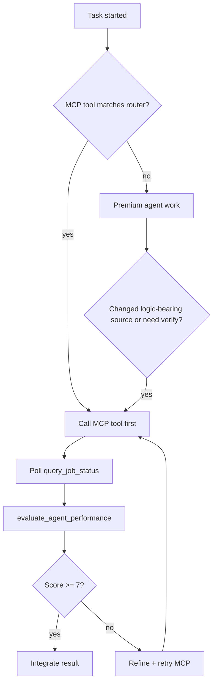

# mcp-adjutant delegation

Offload expensive, repetitive work to **mcp-adjutant** sub-agents (Scout, Triage, Builder, Transformer, WebFetcher, Evaluator). They run on cost-effective models configured in the mcp-adjutant config UI. You stay on the premium model for judgment, integration, and user-facing decisions.

**Prerequisite:** `mcp-adjutant` MCP must be connected with these tools available:

| Tool | Sub-agent | Delegate when |
| --- | --- | --- |
| `scout_context` | Scout | Repo layout, tracing, impact analysis, “where is X” |
| `analyze_log` | LogAnalyzer | Log files — crash triage, CI failures, error search in logs |
| `verify_and_triage` | Triage | After code changes — compile, type-check, trivial fixes |
| `generate_tests_and_scaffolding` | Builder | Unit/integration/factory tests for a source file |
| `web_fetch` | WebFetcher | External docs, API specs, library behavior, comparisons |
| `execute_global_refactor` | Transformer | Rename method/struct; propagate signature changes |
| `evaluate_agent_performance` | Evaluator | QA a sub-agent result before trusting or re-delegating |
| `query_job_status` | — | Poll every async job until `terminal=true` |

---

## MCP-first rule (always when connected)

**Before** Grep/Read chains, `WebSearch`, `WebFetch`, `Task`/explore, `fastcontext`, manual `cargo`/`npm`, or hand-writing tests:

1. Check the [tool router](#tool-router) — if a row matches, call the MCP tool **first**.
2. Poll `query_job_status` until `terminal=true`.
3. Run `evaluate_agent_performance` on every sub-agent result (medium/hard).
4. Only self-serve what MCP did not cover.

When `MCP_ADJUTANT_REQUIRE_BUILDER=true`, skipping `generate_tests_and_scaffolding` after editing **logic-bearing source** (see [Builder scope](#builder-scope)) is a **rule violation** — call builder or document N/A in the [session checklist](#session-checklist-hard--medium) and [builder ledger](#builder-ledger-hard--medium).

When `MCP_ADJUTANT_REQUIRE_LOG_ANALYZER=true`, skipping `analyze_log` when investigating log files is a **rule violation**.

On session start, read `.cursor/mcp.json` env. If `MCP_ADJUTANT_REQUIRE_BUILDER=true`, announce once: **"Builder required — no hand-written tests for new/changed logic-bearing source."**

## Builder gate (`MCP_ADJUTANT_REQUIRE_BUILDER=true`)

**Before** `cargo test`, `npm test`, `pytest`, `go test`, handoff, or claiming "done":

1. Collect every [logic-bearing source file](#builder-scope) you **created or changed behavior in** this session.
2. For **each** file → one `generate_tests_and_scaffolding` call (`test_type: unit` unless integration/factory is obvious).
3. Poll `query_job_status` until `terminal=true` per file.
4. Run `evaluate_agent_performance` on each builder result (`target_agent`: `Phase_4_Builder`, score ≥ 7).
5. Only then `verify_and_triage`.

**Forbidden substitutes for builder (even if tests pass):**

- Hand-writing new test files, new test modules, or co-located test blocks (`describe`/`it`, `def test_`, `#[test]`, `func Test`, …) for logic you added
- Project test runners (`cargo test`, `npm test`, `vitest`, `pytest`, `go test`, …) as proof builder was unnecessary
- "fixtures were small / trivial" without an explicit N/A row in the [builder ledger](#builder-ledger-hard--medium)

**Allowed N/A (must document per file in builder ledger):**

- Comment-only, formatting-only, or rename-only edits with zero behavior change
- Pure re-export / barrel files with no new logic
- Docs, lockfiles, generated `dist/` / `target/` output, CI YAML with no app logic
- Language or layout where builder cannot target the file (say why; use that stack's normal test command via triage instead)

### Builder scope

**Logic-bearing source** = application code where you added or changed executable behavior (functions, methods, types with logic, components with behavior, modules, classes).

Use **path + role**, not a single language. Examples:

| Stack | Usually in scope | Usually out of scope |
| --- | --- | --- |
| Rust | `src/**/*.rs`, `benches/*.rs` with logic | `build.rs` config-only, generated code |
| TypeScript / JavaScript | `**/*.{ts,tsx,js,jsx}` under app roots (`frontend/`, `packages/`, `lib/`, `app/`) | `*.config.*`, `*.d.ts`, story-only files if no logic changed |
| Python | `**/*.py` under `src/`, `lib/`, package roots | `__pycache__/`, empty `__init__.py` re-exports |
| Go | `**/*.go` outside `vendor/` | generated `*.pb.go` if untouched |
| Java / Kotlin | `src/main/**/*.{java,kt}` | resources-only edits |
| C / C++ | `src/**/*.{c,cpp,cc,h,hpp}` | headers that only declare what you didn't implement |

When unsure, treat the file as in scope and call builder once; document N/A only with a concrete reason.

### Tool router

| User intent / trigger | MCP tool (required) | Never substitute with |
| --- | --- | --- |
| Log investigation, crash triage, CI log analysis, searching errors in log files | `analyze_log` | `scout_context`, Grep, Read, fastcontext, manual grep on log files |
| Repo layout, tracing, impact, “where is X” | `scout_context` | fastcontext, Grep chains, Task explore |
| After any code edit | `verify_and_triage` | cargo/npm manually, ReadLints only |
| New/changed logic in logic-bearing source without builder | `generate_tests_and_scaffolding` | Hand-written test files |
| External docs, API specs, library usage | `web_fetch` | WebSearch, WebFetch, guessing |
| Signature/name change across many files | `execute_global_refactor` | Manual multi-file edit |
| QA any sub-agent output | `evaluate_agent_performance` | Trusting output unchecked |
| Poll async jobs | `query_job_status` | Guessing timeouts |

---

## Set delegation level

Resolve level in this order (first match wins):

1. **User instruction** — e.g. "delegation: hard" or "use adjutant sparingly"
2. **`MCP_ADJUTANT_DELEGATION_LEVEL`** env var — `low`, `medium`, or `hard`
3. **Default:** `medium`

Announce the active level once per session when you first delegate.

---

## LOW — delegate only when clearly cost-effective

Delegate **only** when you are confident the sub-agent can complete the task without premium-model judgment.

### Delegate (low)

| Situation | Tool |
| --- | --- |
| Broad repo search across many files | `scout_context` |
| Log file triage (local path, `https://` URL, or `gh-run:<id>`) | `analyze_log` |
| Mechanical compile/type errors (imports, typos, missing semicolons) | `verify_and_triage` |
| Boilerplate test files for an existing function/module | `generate_tests_and_scaffolding` |
| Need authoritative external doc snippet | `web_fetch` |
| Mechanical rename across known call sites | `execute_global_refactor` |

### Do NOT delegate (low)

- Architecture or API design decisions
- Security-sensitive changes (auth, crypto, injection)
- Multi-file refactors requiring trade-off judgment
- Tasks where you need fewer than ~3 files of context
- When mcp-adjutant is not connected or API keys are unset

### Low workflow

1. Ask: "Would a cheaper model succeed here with no ambiguity?" If no → do it yourself.
2. Call the tool with a precise `request_uuid` (UUID v4).
3. Poll `query_job_status` until `terminal=true`.
4. If output is weak but partially useful → **one retry** with a tighter prompt (see [Iterative refinement](#iterative-refinement--never-give-up-on-the-first-weak-result)).
5. Skim the result; spot-check critical claims before acting on them.

---

## MEDIUM — balanced (default)

Start selective like **low**, then **adapt** based on evaluator scores from past delegations in this session.

### Initial gate (same as low)

Before first delegation on a task type, apply the low-mode "clearly cost-effective" test.

### After each delegation

Call `evaluate_agent_performance` when the result will influence your next steps:

```json
{
  "target_agent": "Phase_1_Scout",
  "original_task": "<what you asked for>",
  "received_output": "<sub-agent result>",
  "request_uuid": "<new-uuid>"
}
```

Poll until `terminal=true`. Parse the JSON score and critique.

### Adapt using evaluator score

| Score | Next action |
| --- | --- |
| **8–10** | Accept or do one polish pass if you need perfection; keep delegating similar tasks |
| **5–7** | **Retry 2–3 times** with progressively tighter prompts; verify key facts yourself |
| **1–4** | **Retry 2 times** with heavily narrowed scope and explicit gaps from the critique; only then self-serve |

Track mentally per category: **scout**, **triage**, **builder**, **web_fetcher**, **transformer**.

### Medium-specific rules

- **Scout** → delegate when exploration spans 5+ files or unknown layout; otherwise use local search/read.
- **Triage** → delegate after every substantive edit batch; skip for comment-only or doc-only changes.
- **Builder** → delegate one file at a time after logic changes; review generated tests before committing.
- **Web fetch** → delegate before citing library/API behavior you did not verify in-repo.
- **Weak first result** → refine prompt and re-delegate; do not abandon after one try.
- Re-evaluate after **two consecutive scores below 6** on the **same task after retries** → switch that task to self-serve; do not blacklist the whole category from one bad first attempt.

---

## HARD — MCP is the default toolbelt

**Do not** use native exploration/build/test tools when an MCP row matches. Hard mode is mandatory in this repo (`MCP_ADJUTANT_DELEGATION_LEVEL=hard`).

### Mandatory pipelines

**Feature / bugfix session (strict order):**

1. `scout_context` — map affected modules (if >2 files or layout unknown)
2. Premium implements **logic only** in logic-bearing source — **do not create new test files or test modules** in this step
3. `generate_tests_and_scaffolding` — **one call per touched logic-bearing source file** (before any project test runner)
4. Review builder output; premium may **edit** generated tests, not replace with from-scratch test files
5. `verify_and_triage` — always before handoff
6. `evaluate_agent_performance` — on scout, **each builder**, and triage outputs (score ≥ 7)

**External research session:**

1. `web_fetch` — before citing library/API behavior
2. `scout_context` — map where the repo integrates it
3. `evaluate_agent_performance` — on both outputs

**Global rename / signature change:**

1. `scout_context` — list call sites (optional if scope is narrow)
2. `execute_global_refactor` — with `scope_path` when possible
3. `verify_and_triage`
4. `evaluate_agent_performance`

### Hard rules (non-negotiable)

| Trigger | Required action |
| --- | --- |
| Any non-trivial task needing repo context | `scout_context` first |
| Any log file investigation | `analyze_log` first |
| Any code change (including small edits) | `verify_and_triage` before commit or handoff |
| New or changed logic in logic-bearing source | `generate_tests_and_scaffolding` per affected file |
| Citing external library/API behavior | `web_fetch` first |
| Propagating rename/signature across files | `execute_global_refactor` |
| Every sub-agent result before use | `evaluate_agent_performance` |

### Hard workflow

1. Generate a fresh `request_uuid` per tool call.
2. Fire the tool; immediately poll `query_job_status` (do not guess timeouts).
3. On `terminal=true` with `status=completed`, run `evaluate_agent_performance`.
4. If evaluator score **< 7**, **loop**: refine prompt from critique → re-delegate same tool → re-evaluate. Repeat until score ≥ 7 or 5 rounds exhausted.
5. Integrate verified results into your response; cite what the sub-agent found/changed.
6. Fill the [session checklist](#session-checklist-hard--medium) before handoff.

### Hard exceptions (still do yourself)

- Direct user chat, clarifying questions, and final summaries
- Choosing between architectural alternatives (sub-agents inform, you decide)
- When mcp-adjutant tools are unavailable — fall back gracefully and tell the user

### Session checklist (hard / medium)

Before handoff on substantive work, include in your response (or internal trace):

```markdown
### Adjutant checklist
- [ ] scout_context — Y/N (query: …)
- [ ] analyze_log — Y/N (log_path: …) — required when task touches logs
- [ ] generate_tests_and_scaffolding — Y/N (see builder ledger)
- [ ] verify_and_triage — Y/N
- [ ] web_fetch — Y/N or N/A
- [ ] execute_global_refactor — Y/N or N/A
- [ ] evaluate_agent_performance — scores: scout …, builder …, triage …, web …
```

### Builder ledger (hard / medium)

Fill **before handoff** when any logic-bearing source changed. Empty ledger + changed logic = incomplete session.

```markdown
### Builder ledger
| Source file | Builder UUID | Status | Eval score | Test output path | N/A reason |
|-------------|--------------|--------|------------|------------------|------------|
| `path/to/module.ext` | … | completed / failed / N/A | … | … | (only if N/A) |
```

One row per touched logic-bearing file. `MCP_ADJUTANT_REQUIRE_BUILDER=true` and zero builder calls with no N/A rows → **do not hand off**.

---

## Async job protocol (all levels)

Every heavy tool requires `request_uuid`. **Never** treat the initial response as the final result.

```
1. uuid = new UUID v4
2. call tool(..., request_uuid=uuid)
3. loop: query_job_status(request_uuid=uuid) until terminal=true
4. if status=completed → use result
   if status=failed    → read error; decide retry/self-serve per level
   if possibly_stalled → keep polling (advisory only)
```

Run polls in the same turn when possible. Do not ask the user to wait without polling.

---

## Iterative refinement — never give up on the first weak result

A single sub-agent call is a **draft**, not a verdict. When output is incomplete, vague, or wrong, **retry** with a better prompt instead of abandoning delegation or redoing everything yourself.

### Core rule

**Do not give up after one attempt.** Run multiple rounds on the same task until the result is usable or you have exhausted a level-appropriate retry budget.

| Level | Min retries before self-serve / escalate | Max rounds per task |
| --- | --- | --- |
| **low** | 1 refined retry if the first result was close | 2 total |
| **medium** | 2 refined retries | 3–4 total |
| **hard** | 3+ refined retries | 5+ total (polish until score ≥ 7) |

### How to build the next prompt

Each retry must be **strictly more specific** than the last. Carry forward what worked and what failed:

1. **Quote the gap** — what was missing, wrong, or too shallow in the previous output
2. **Paste the critique** — use `evaluate_agent_performance` JSON (`score`, `critique`) or your own diff against requirements
3. **Add constraints** — file paths, symbols, acceptance criteria, things to exclude
4. **Narrow scope** — one subdirectory, one module, one error class, one test case at a time
5. **Reference prior output** — "Previous attempt found X but missed Y; focus only on Y in `src/foo.rs`"

Example scout retry progression:

```text
Attempt 1: "How does authentication work?"
→ weak: generic overview, no file paths

Attempt 2: "Previous output lacked file paths. List every auth middleware file
under src/ with function names. Ignore tests and docs."

Attempt 3: "Found jwt.rs but missed session refresh. Trace refresh flow from
login handler to token store; include call graph for refresh_token()."
```

### Query hygiene (scout + triage)

Write scout queries with **symbol names and module paths**, not vague natural-language phrases:

- Good: `"Where is LlmUsage defined and recorded? List file:line for src/metrics/ and src/llm/factory.rs"`
- Bad: `"token metrics implementation state"`

Triage results include structured evidence after a pass: modules checked, commands run, exit status, and build log excerpts — not a generic one-liner. Use that evidence in your integration step and when pasting into `evaluate_agent_performance`.

### Same agent, same task — polish iteratively

You may call the **same tool multiple times** on one task. Treat it as refinement, not duplication:

| Tool | Iteration pattern |
| --- | --- |
| `scout_context` | Broad map → drill into gaps → verify edge cases / call sites |
| `verify_and_triage` | Fix batch → re-run on remaining errors → final clean pass |
| `generate_tests_and_scaffolding` | Scaffold → add edge cases → tighten assertions |
| `web_fetch` | Broad topic → narrow to API surface → verify against repo usage |
| `execute_global_refactor` | Narrow scope_path → verify call sites → re-run triage |
| `evaluate_agent_performance` | Score draft → retry sub-agent → re-evaluate polished output |

Use a **new `request_uuid` per attempt**. Keep a short mental log: `attempt N / tool / prompt summary / outcome`.

### When to stop retrying

Stop iterating only when **one** of these is true:

- Evaluator score ≥ 7 (medium/hard) or your spot-check passes (low)
- Retry budget for the level is exhausted — then self-serve the remainder or ask the user
- Error is architectural (sub-agent cannot fix without human decision)
- Same failure repeats twice with no progress — change strategy (narrow prompt, different paths, or switch tool)

**Never** stop because "the first try wasn't good enough." That is the signal to refine, not quit.

---

## Tool argument quick reference

**analyze_log**

```json
{ "log_path": "target/debug/test.log", "request_uuid": "<uuid>" }
```

Remote sources (same tool — babysitter/CI):

```json
{ "log_path": "gh-run:12345678901", "request_uuid": "<uuid>" }
{ "log_path": "https://example.com/artifacts/build.log", "request_uuid": "<uuid>" }
```

After `gh pr checks` fails: `gh run view <run-id> --log-failed` → pass `gh-run:<run-id>` to `analyze_log` instead of pasting raw log text.

**scout_context**

```json
{ "query": "Where is LlmUsage defined? List file:line under src/metrics/ and src/llm/", "request_uuid": "<uuid>" }
```

Prefer symbol/module paths over natural-language phrases (e.g. `LlmUsage`, `record_llm_call`, not "token metrics state").

**verify_and_triage**

```json
{ "target_paths": ["src/foo.rs"], "request_uuid": "<uuid>" }
```

Omit `target_paths` or pass `[]` to use git dirty files.

**generate_tests_and_scaffolding**

```json
{
  "source_file_path": "src/agent/scout.rs",
  "test_type": "unit",
  "request_uuid": "<uuid>"
}
```

`test_type`: `unit` | `integration` | `factory`. Call **once per logic-bearing source file** with new/changed logic. Examples: `src/agent/scout.rs`, `frontend/src/modules/config-ui/ConfigApp.tsx`, `lib/foo.py`.

**web_fetch**

```json
{
  "search_phrase": "Chart.js stacked bar chart API 2024",
  "request_uuid": "<uuid>"
}
```

Use for library docs, API specs, release notes — not for in-repo code (use scout).

**execute_global_refactor**

```json
{
  "method_name": "record_llm_call",
  "refactor_instruction": "Add model_name: &str parameter after phase",
  "scope_path": "src/metrics",
  "request_uuid": "<uuid>"
}
```

**evaluate_agent_performance**

```json
{
  "target_agent": "Phase_1_Scout",
  "original_task": "Find JWT middleware entry points",
  "received_output": "<paste sub-agent output>",
  "request_uuid": "<uuid>"
}
```

`target_agent` examples: `Phase_1_Scout`, `Phase_5_Triage`, `Phase_4_Builder`, `WebFetcher`, `Phase_3_Transformer`.

---

## Decision flowchart



---

## Anti-patterns

- Reading dozens of files into context when `scout_context` would suffice (**hard** and often **medium**)
- **Implement → hand-write tests → run test runner → triage only at end** — builder skipped; use [builder ledger](#builder-ledger-hard--medium)
- **"fixtures were small"** — not an exemption when `MCP_ADJUTANT_REQUIRE_BUILDER=true`
- **Scout + triage + evaluate only** — skipping builder, web_fetch, and refactor when triggers match
- Implementing features and **never calling `generate_tests_and_scaffolding`** (hard violation when `MCP_ADJUTANT_REQUIRE_BUILDER=true`)
- Using **WebSearch** or **WebFetch** when `web_fetch` MCP is available
- Using **Grep/Read/fastcontext** on log files when `analyze_log` MCP is available
- Using **Task/explore** or **fastcontext** when `scout_context` applies
- Committing after edits without `verify_and_triage` (**hard** always; **medium** after substantive edits)
- Ignoring `evaluate_agent_performance` in **medium**/**hard** and trusting unverified sub-agent output
- Delegating ambiguous architecture work in **low** mode
- Stopping polling before `terminal=true`
- **Giving up after one weak sub-agent result** instead of retrying with a better prompt
- **Repeating the same vague prompt** — each retry must add constraints, paths, or critique from the prior attempt
- **Self-serving immediately** when a refined delegation round would be cheaper than loading files into context

---

## Enforcement companion

Skills are policy; they do not block edits. Pair this skill with:

1. **[`.cursor/rules/builder-gate.mdc`](../rules/builder-gate.mdc)** — always-on reminder after logic-bearing edits (all languages).
2. **Session announce** — when `MCP_ADJUTANT_REQUIRE_BUILDER=true`, state builder requirement at first delegation (see [MCP-first rule](#mcp-first-rule-always-when-connected)).
3. **Optional Cursor hook** — on `afterFileEdit`, if the path matches logic-bearing patterns (not `*.md`, not lockfiles), append a one-line reminder to update the builder ledger before handoff. Example glob intent: application source trees, not docs-only.

Empty builder ledger at handoff with changed logic = treat as **failed session**, same as red CI.
